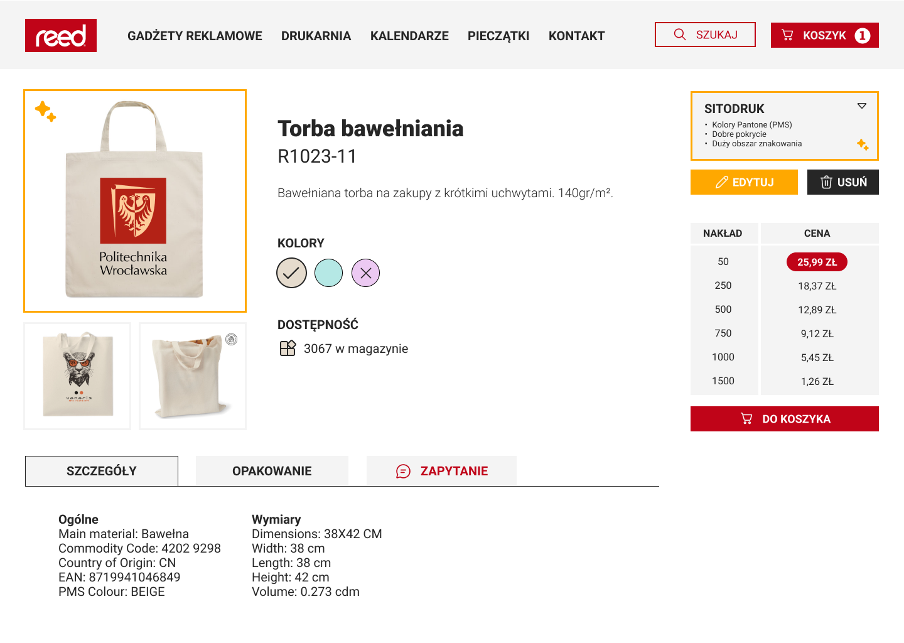

# masters-thesis

## "Analysis of tools for visualizing advertising articles"

This project was created for [REED](https://reed.kalisz.pl/) company that specializes in comprehensive printing and advertising services. The goal was to analyze existing tools for visualizing promotional items, identify their strengths and weaknesses, and design a new, improved solution tailored to the requirements of the cleint, and users in the advertising industry in general. The project involved research such as usability testing and prototyping to create an intuitive and efficient web-based tool for personalizing promotional products like bags, mugs, and pens with custom graphics or logos.

### Research and Analysis

A comprehensive review of existing tools (PAR, MidOcean, and Drukomat) was conducted, evaluating their usability, functionality, performance, and compatibility. Usability tests, including 5-second tests, eye-tracking, first-click tests and preference testing, revealed key pain points such as non-intuitive navigation, unstable editing tools, and unclear instructions. Functional testing assessed features like image uploads, text editing, and real-time visualization, while performance metrics (e.g., load times, compatibility) were measured using tools like Google Lighthouse and Chrome DevTools. The results highlighted MidOcean as the most user-friendly but identified areas for improvement across all tools.

Eye-tracking | Word Cloud
-|- 
 | 

### Design and Prototyping

The design phase focused on creating a tool with a focus on simplicity and efficiency. Based on the research findings, the interface was streamlined to minimize friction — clear navigation, highlighted action buttons, and a streamlined workflow that allows users to personalize products before adding them to the cart. The editor supports both vector and raster graphics, uploading logos, adjusting colors, removing backgrounds, and precisely positioning elements within a defined print area. A key improvement was the implementation of automatic saving, ensuring users never lose their progress, alongside undo/redo functionality.

Usecase Diagram |
-|
 |

Sketches were drawn in Affinity Design and later turned into Mockups using Figma, visualizing the user journey, from product selection, through the editor, to the final checkout. The design incorporated feedback from usability tests. The editor interface includes drag-and-drop zones for seamless image uploads, real-time previews, visual indicators for personalized items, and contextual help. These refinements resulted in a prototype that balances advanced functionality with ease of use, addressing all the core frustrations identified in existing tools.

Before Personalization Sketch | After Personalization Sketch
-|- 
 | 

Editor Sketch | Basket Sketch
-|- 
 | 

Before Personalization Mockup | After Personalization Mockup
-|- 
 | 

Editor Mockup | Basket Mockup
-|- 
 | 

### Outcomes and Future Work

The project successfully delivered a prototype that addressed the limitations of existing tools, emphasizing user experience and functionality. The client confirmed that the solution met their core requirements. Next steps include developing a functional prototype, implementing the design, and conducting further user testing to refine the tool.

This project showcases expertise in UX/UI design, usability research, and web application analysis. The detailed process—from problem identification to solution design—demonstrates the ability to translate user needs into practical, innovative tools.
